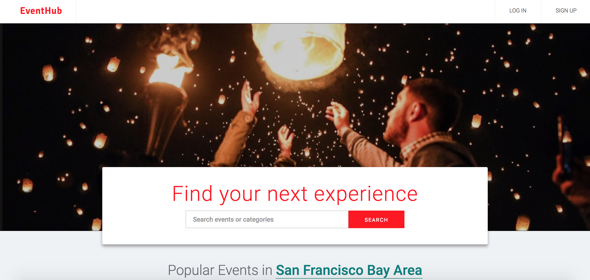
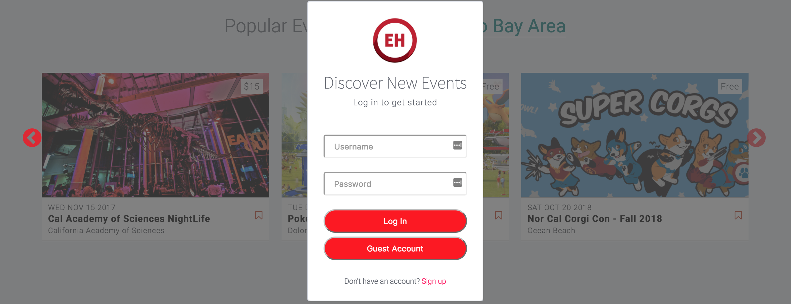
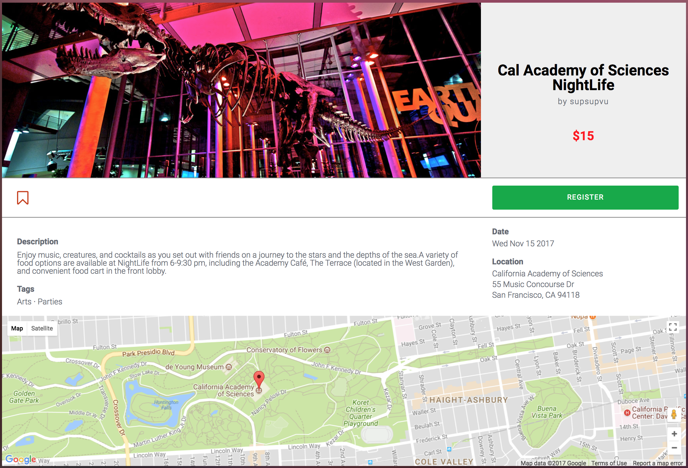

# EventHub

[EventHub](http://eventhub-app.herokuapp.com/) is a full stack web application inspired by Eventbrite. It was built using Ruby on Rails on the backend, a PostgreSQL database, and React.js with Redux architecture on the front end.

The application allows users to create events, browse events, and register for event tickets.



## Technologies Used

* Ruby on Rails
* jBuilder
* PostgreSQL
* React.js / Redux
* HTML5
* CSS3

Ruby on Rails is a back-end MVC framework that was used to build a RESTful API and for data-fetching from a PostgreSQL database.

The front end application was written using Javascript's React library for reuseable, modular code. It was used in conjunction with the Redux framework to add in the benefits of a unidirectional data flow which made the application easier to debug.

## Project Design and Development

To get started on this app, I spent a day designing the [database schema](https://github.com/vutpham/event-hub/blob/master/docs/schema.md), creating the initial project wireframes, and mapping out my [API endpoints](https://github.com/vutpham/event-hub/blob/master/docs/api-endpoints.md).

After the plan was complete, I began developing the site in [state slices](https://github.com/vutpham/event-hub/blob/master/docs/sample-state.md). With each slice, I created static components that helped me visualize the data structure I would need when making AJAX requests. Next, I would move into the backend, testing my endpoints to ensure the data would be easily consumed in my React views. After the backend for a given slice was finished, I began my redux cycle implementation. I would work from my AJAX request to my actions and finally into the reducers, testing after each piece. And finally, I would make my static components dynamic, creating container components where necessary.

Styling was done after functionality was achieved. I tried to make my clone look as similar to Eventbrite as possible. Styling was organized by CSS nesting rules which is supported by the use of SASS.

## Features

### User Authentication



BCrypt is used for secured salting and hashing of passwords. Salting a password prepends a random string to the password so duplicate passwords will not have the same hash stored in the backend.

```ruby
# user.rb
# Password is hashed upon login
  def password=(password)
    @password = password
    self.password_digest = BCrypt::Password.create(password)
  end

  def is_password?(password)
    BCrypt::Password.new(self.password_digest).is_password?(password)
  end

# Session token is saved upon login and reset upon logout
  def reset_session_token!
    self.session_token = SecureRandom.urlsafe_base64(16)
    self.save
    self.session_token
  end

  def ensure_session_token
    self.session_token ||= SecureRandom.urlsafe_base64(16)
  end
```


### Event Upload

Events can be created and stored in the database with an id, title, date, address, description, img_url, price, and host_id.  The host_id is a foreign key pointing to the event creator. Images are hosted on Cloudinary's image management service. If an image is not uploaded, a default image will be assigned to the event and uploaded to the database. Events with an unspecified price are assumed to be free, while an address that cannot be found using the Google Maps API will default the map location to San Francisco, CA.

Users can create, update and destroy their own hosted events.

### Event Categories


Events have a many-to-many relationship with different categories through a joins table in the database called EventCategories. An event can have multiple categories, while a category can list multiple events.


Users can browse events by the seven top categories:  music, food & drinks, classes, business, parties, arts, and sports.  A "filter" component listens for selection of a category in its list. When a category is clicked, a change in the route triggers an API call to a controller action, which fetches all of events associated with the particular category clicked on. Lazy loading is implemented so the database is not hit with a huge query.

```javascript
navigateToCategory(key){
  return (e) => {
    this.props.fetchFilteredEvents({category_names: [key]})
      .then( () => {
        this.props.history.push(`browse-events/${key}`);
      });
  };
}
```

### Registrations / Bookmarking

Logged in users can bookmark and register for events.  Registrations and bookmarking is done through the use of a joins table between users and events. Events are rendered on the front end with a bookmark and a list of bookmarked events can be found by navigating to the "Saved Events" page via the dropdown menu on the navbar. When a user clicks a bookmark, an API call is sent to the back end to toggle between creating and destroying that bookmark. Ticket registrations are done with a similar API call, but only from the event details page.

```javascript
// ./components/events/index_event/event_slider_item.jsx
toggleBookmark(){
  let {id, bookmarked} = this.props.event;
  if(this.props.loggedIn){
    bookmarked ? this.props.unBookmarkEvent(id) : this.props.bookmarkEvent(id);
  }
  else{
    window.globalOpenModal();
  }
}
```

### Search

Users can currently search for events via a search form on the homepage. When the form is submitted, an API call is made to the backend to fetch events with the search_string in the title or description using the following ActiveRecord query:

```ruby
@events = Event.where("LOWER(title) LIKE LOWER(:search_string) OR LOWER(full_description) LIKE LOWER(:search_string)",
          search_string: "%#{params[:search_string]}%")
```

### Google Maps Integration

This application uses the Google Maps API to render the event locations. A call to Google's Geolocation API retrieves the latitude and longitude associated with that address, which is in turn used to make an additional call to pin a marker on the map component. Google maps is integrated into both the event browse page and the event detail page.



## Future Implementations

### Search Bar Improvements

Currently, users are only able to search for events from the home screen. In order to improve UX, a search bar should be visible at all time. Future plans include adding a search bar to the navbar when the user navigates away from the home component. Other ideas include autocomplete and search suggestions when the user starts typing.

### Hashtags

Similar to the actual Evenbrite site, users should be able to assign personalized tags to events. These tags will enhance search and filter capabilities.

### Calendar

The addition of a calendar would tremendously improve UX. Users would be able to sort and filter events by date. This will help users avoid date / time conflict when booking events.
